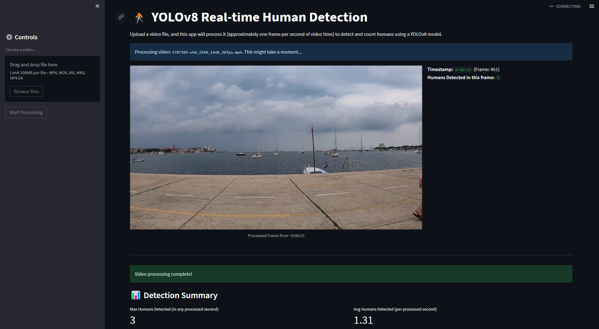

# YOLOv8 Human Detection with Streamlit UI

This project uses a YOLOv8 model to detect and count humans in video files. It provides a simple Streamlit web interface for uploading videos and viewing the detection results.

 


## Features

*   Detects humans in uploaded video files.
*   Processes approximately one frame per second of video time for efficiency.
*   Displays the processed video with bounding boxes around detected humans.
*   Shows a running count of humans detected per processed frame with timestamps.
*   Provides a summary of detection results (max/avg humans, detection chart) after processing.
*   User-friendly web interface built with Streamlit.

## Prerequisites

*   Python 3.7+
*   A YOLOv8 model file ( `best.pt` in the same dir)

## Setup

1.  **Clone the Repository:**
    ```bash
    git clone https://github.com/BANZOM/YOLOv8-HumanDetection.git 
    cd YOLOv8-HumanDetection
    ```

2.  **Create a Virtual Environment (Recommended):**
    ```bash
    python -m venv venv
    source venv/bin/activate  # On Windows: venv\Scripts\activate
    ```

3.  **Install Dependencies:**
    ```bash
    pip install -r requirements.txt
    ```

4.  **Set up Environment Variables:**
    *   Create a file named `.env` in the root directory of the project.
    *   Add the path to your YOLOv8 model file:
        ```env
        MODEL_PATH=best.pt
        ```
        *Example:* `MODEL_PATH=./models/yolov8n.pt` (if you place your model in a `models` subfolder).
        *Make sure the path is correct and the model file exists.*

## Running the Application

1.  **Navigate to the project directory** (if you aren't already there).

2.  **Ensure your virtual environment is activated.**

3.  **Run the Streamlit app:**
    ```bash
    streamlit run streamlit_app.py
    ```
    *(Replace `streamlit_app.py` with the actual name of your Streamlit Python file if it's different.)*

4.  Open your web browser and go to the local URL provided by Streamlit (usually `http://localhost:8501`).

## How to Use the App

1.  Once the app is running in your browser, you'll see a sidebar.
2.  Click on "Choose a video..." to upload a video file (supported formats: .mp4, .mov, .avi, .mkv).
3.  After uploading, click the "Start Processing" button.
4.  The app will begin processing the video. You'll see:
    *   A progress bar.
    *   The processed video frame updating approximately once per second of video time, with detected humans highlighted by bounding boxes.
    *   The current timestamp and human count for the displayed frame.
5.  Once processing is complete, a summary of detections (max humans, average humans, and a chart) will be displayed.

